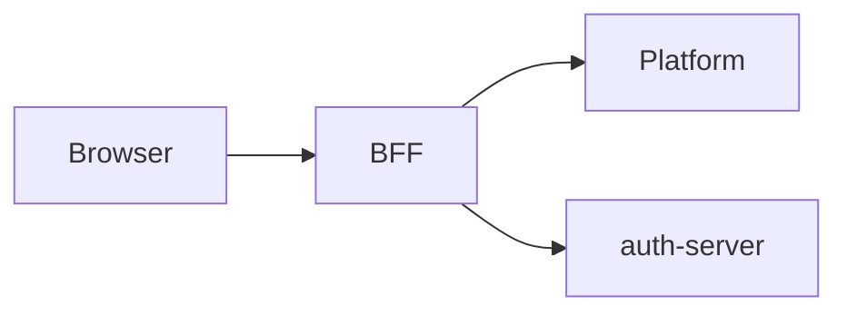

# 本書簡介

本書說明 CuriosityLab 平台如何建構，以繁體中文撰寫（英文版之後再補）。

::: tip 設計決策在哪裡？
本書不複製決策內容，只以編號引用，例如 `ADR-SHARED-0002`。完整的工程文件在儲存庫的 `docs/`。
:::

```mermaid
flowchart LR
    Browser --> BFF --> Platform
    BFF --> Auth[auth-server]
```
